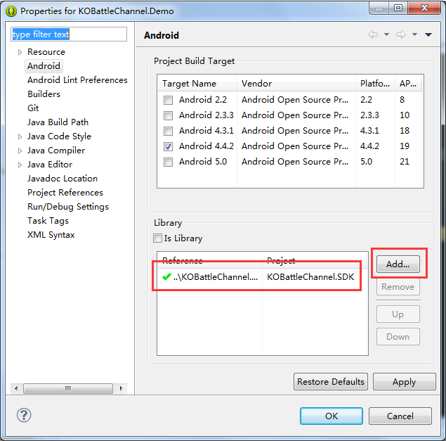
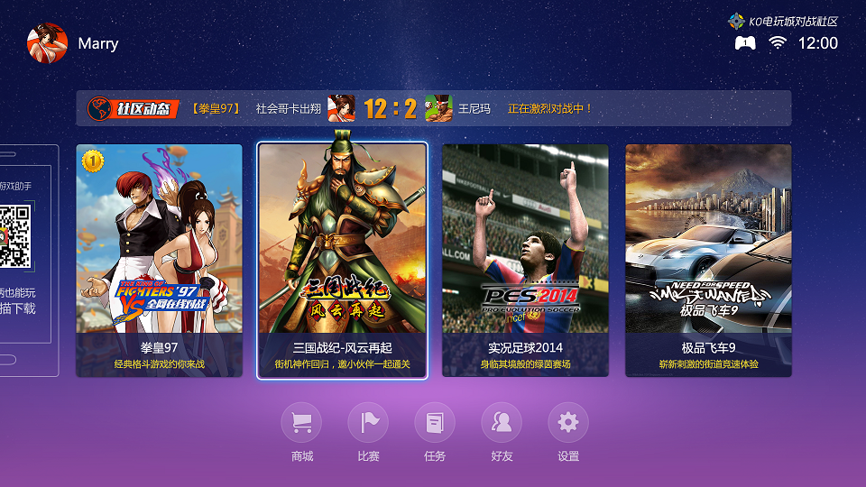

# KOBattleChannleSDK KO对战游戏频道SDK
#### 功能
通过该SDK，允许第三方将KO对战游戏频道接入到其应用


SDK接入步骤：
####1. 将项目 KOBattleChannel.SDK 导入到Eclipse 中
####2. 在您的项目工程中：
右键->Properties ->Android ->在Library中选择刚刚导入的KOBattleChannel.SDK项目

####3. 修改AndroidManifest.xml
在您的项目工程的AndroidManifest.xml 添加如下代码段：
#####**权限**
``` xml
   <permission
        android:name="cn.vszone.ko.permission.PAUSE_ENGINE"
        android:protectionLevel="dangerous" >
    </permission>
    <permission
        android:name="cn.vszone.ko.permission.RESUME_ENGINE"
        android:protectionLevel="dangerous" >
    </permission>

    <!-- 接收系统通知权限组 -->
    <uses-permission android:name="android.permission.RESTART_PACKAGES" />
    <uses-permission android:name="android.Manifest.permission.KILL_BACKGROUND_PROCESSES" />
    <!-- 保持屏幕高亮权限组 -->
    <uses-permission android:name="android.permission.WAKE_LOCK" />
    <!-- 访问网络状态权限组 -->
    <uses-permission android:name="android.permission.INTERNET" />
    <uses-permission android:name="android.permission.ACCESS_WIFI_STATE" />
    <uses-permission android:name="android.permission.ACCESS_NETWORK_STATE" />
    <uses-permission android:name="android.permission.CHANGE_WIFI_STATE" />
    <!-- 读写SD卡权限组 -->
    <uses-permission android:name="android.permission.MOUNT_UNMOUNT_FILESYSTEMS" />
    <uses-permission android:name="android.permission.WRITE_SETTINGS" />
    <uses-permission android:name="android.permission.WRITE_EXTERNAL_STORAGE" />
    <uses-permission android:name="android.permission.MOUNT_UNMOUNT_FILESYSTEMS" />
    <uses-permission android:name="android.permission.READ_EXTERNAL_STORAGE" />
    <!-- 读取IMEI的权限 -->
    <uses-permission android:name="android.permission.READ_PHONE_STATE" />
    <!-- 系统操作权限组 -->
    <uses-permission android:name="com.android.launcher.permission.READ_SETTINGS" />
    <uses-permission android:name="com.android.launcher.permission.WRITE_SETTINGS" />
    <uses-permission android:name="com.android.launcher.permission.INSTALL_SHORTCUT" />
    <uses-permission android:name="com.android.launcher.permission.UNINSTALL_SHORTCUT" />
    <uses-permission android:name="android.permission.VIBRATE" />
    <uses-permission android:name="android.permission.READ_LOGS" />
    <uses-permission android:name="android.permission.ACCESS_COARSE_LOCATION" />
    <uses-permission android:name="android.permission.BLUETOOTH" />
    <uses-permission android:name="android.permission.BLUETOOTH_ADMIN" />
    <uses-permission android:name="android.permission.CHANGE_CONFIGURATION" />
    <uses-permission android:name="android.permission.BROADCAST_STICKY" />
    <!-- 全局Dialog -->
    <uses-permission android:name="android.permission.SYSTEM_ALERT_WINDOW" />
    <!-- 全局Dialog -->
    <uses-permission android:name="cn.vszone.ko.permission.PAUSE_ENGINE" />
    <uses-permission android:name="cn.vszone.ko.permission.RESUME_ENGINE" />
    <uses-permission android:name="android.permission.GET_TASKS" />
``` 
#####*applicatin 节点中添加meta**
``` xml
        <meta-data
            android:name="KO_APPKEY"
            android:value="xxxxxxxxxx" />
        <meta-data
            android:name="KO_CHANNEL"
            android:value="xxxxxxxxx" />
```
其中 **KO_CHANNEL**为合作方的名称（英文), **KO_APPKEY** 为应用标识，该值由第三方开发者工程的包名和签名计算，具体计算方法请联系[help@vszone.cn](luoyi@vszone.cn)

#####*applicatin 节点中添加activity, service 等**

```xml
       <activity
            android:name="cn.vszone.ko.tv.battle.channel.StartUpActivity"
            android:configChanges="keyboardHidden"
            android:screenOrientation="landscape"
            android:theme="@android:style/Theme.Translucent.NoTitleBar.Fullscreen" >
        </activity>
        <activity
            android:name="cn.vszone.ko.tv.battle.channel.MainBattleListActivity"
            android:configChanges="keyboardHidden"
            android:label="@string/ko_app_name"
            android:launchMode="singleTask"
            android:screenOrientation="landscape"
            android:theme="@android:style/Theme.Black.NoTitleBar.Fullscreen" />
        <activity
            android:name="cn.vszone.tv.gamebox.DownLoadWebActivity"
            android:screenOrientation="landscape"
            android:theme="@style/KO_Battle_Channel_BlurBackgroundTheme"
            android:windowSoftInputMode="stateUnchanged" />
        <activity
            android:name="cn.vszone.ko.tv.emu.bnet.BattleNetExitActivity"
            android:launchMode="singleTop"
            android:screenOrientation="landscape" />
        <activity
            android:name="cn.vszone.tv.gamebox.BattleNetExerciseGuideActivity"
            android:launchMode="singleTop"
            android:screenOrientation="landscape"
            android:theme="@style/KO_Battle_Channel_BlurBackgroundTheme" />
        <activity
            android:name="cn.vszone.tv.gamebox.BattleNetTipsActivity"
            android:launchMode="singleTask"
            android:screenOrientation="landscape" />
        <activity
            android:name="cn.vszone.tv.gamebox.BattleHallActivity"
            android:hardwareAccelerated="false"
            android:launchMode="singleTop"
            android:screenOrientation="landscape" />
        <activity
            android:name="cn.vszone.ko.tv.emu.bnet.BattleNetPrepareActivity"
            android:exported="true"
            android:launchMode="singleTask"
            android:screenOrientation="landscape"
            android:theme="@style/KO_Battle_Channel_BlurBackgroundTheme" />
        <activity
            android:name="cn.vszone.tv.gamebox.GamePrepareActivity"
            android:exported="true"
            android:launchMode="singleTask"
            android:screenOrientation="landscape"
            android:theme="@style/KO_Battle_Channel_BlurBackgroundTheme" >
            <intent-filter>
                <action android:name="android.intent.action.VIEW" />
            </intent-filter>
        </activity>
        <activity
            android:name="cn.vszone.tv.gamebox.MyAccountActivity"
            android:screenOrientation="landscape"
            android:theme="@style/KO_Battle_Channel_NormalBackgroundTheme" />
        <activity
            android:name="cn.vszone.tv.gamebox.MemoryCleanActivity"
            android:exported="true"
            android:process=":prepare"
            android:theme="@style/TranslucentFullscreen" >
            <intent-filter>
                <action android:name="android.intent.action.VIEW" />
            </intent-filter>
        </activity>
        <activity
            android:name="cn.vszone.ko.tv.emu.FbaMainActivity"
            android:launchMode="singleTask"
            android:screenOrientation="landscape" />
        <activity
            android:name="cn.vszone.ko.tv.emu.EmuMenuActivity"
            android:configChanges="keyboardHidden"
            android:launchMode="singleTask"
            android:screenOrientation="landscape"
            android:theme="@style/KO_Battle_Channel_BlurBackgroundTheme" />
        <activity
            android:name="cn.vszone.tv.gamebox.MyGamePadActivity"
            android:screenOrientation="landscape"
            android:theme="@style/KO_Battle_Channel_NormalBackgroundTheme" />
        <activity
            android:name="cn.vszone.tv.gamebox.GamePadSupportedListActivity"
            android:launchMode="standard"
            android:screenOrientation="landscape"
            android:theme="@style/KO_Battle_Channel_NormalBackgroundTheme" />
        <activity
            android:name="cn.vszone.ko.tv.emu.StateSlotsActivity"
            android:configChanges="keyboardHidden"
            android:screenOrientation="landscape"
            android:theme="@style/TranslucentFullscreen" />
        <activity
            android:name="cn.vszone.tv.gamebox.PadKeyMappingActivity"
            android:launchMode="standard"
            android:screenOrientation="landscape"
            android:theme="@style/KO_Battle_Channel_BlurBackgroundTheme" />
        <activity
            android:name="cn.vszone.ko.tv.emu.bnet.FbaBNetActivity"
            android:launchMode="singleTask"
            android:screenOrientation="landscape" />
        <activity
            android:name="cn.vszone.ko.tv.emu.FbaSettingActivity"
            android:screenOrientation="landscape"
            android:theme="@style/TranslucentFullscreen" />
        <activity
            android:name="cn.vszone.tv.gamebox.ModifyAvatarActivity"
            android:screenOrientation="landscape"
            android:theme="@style/KO_Battle_Channel_NormalBackgroundTheme" />
        <activity
            android:name="cn.vszone.tv.gamebox.ModifyNickNameActivity"
            android:screenOrientation="landscape"
            android:theme="@style/KO_Battle_Channel_NormalBackgroundTheme"
            android:windowSoftInputMode="adjustNothing" />
        <activity
            android:name="cn.vszone.ko.tv.emu.bnet.BattleNetLevelModePrepareActivity"
            android:exported="true"
            android:launchMode="singleTask"
            android:screenOrientation="landscape"
            android:theme="@style/BlurBackgroundTheme" />
        <activity
            android:name="cn.vszone.ko.tv.emu.bnet.FbaBNetLevelModeActivity"
            android:launchMode="singleTask"
            android:screenOrientation="landscape" />

        <service android:name="cn.vszone.ko.gm.download.service.DownloadService" />
        <service android:name="cn.vszone.ko.bnet.core.BattleNetService" />
        <service android:name="cn.vszone.ko.tv.services.KoGameService" />
        <service android:name="cn.vszone.ko.gp.GamePadService" />

        <receiver android:name="cn.vszone.ko.tv.receivers.VsNetReceiver" >
            <intent-filter>
                <action android:name="android.net.conn.CONNECTIVITY_CHANGE" />
            </intent-filter>
        </receiver>

```

####4. Application中添加代码：

```java
    @Override
    public void onCreate() {
        super.onCreate();
        KOChannelSDK.getInstance().onApplicationCreate(this);
    }
    
    @Override
    public void onLowMemory() {
        super.onLowMemory();
        KOChannelSDK.getInstance().onApplicationLowMemory();
    }
```
####5. 需要启动KO对战频道的地方（如Button 的onClick)添加代码：
```java
        Intent intent = new Intent(this, cn.vszone.ko.tv.battle.channel.StartUpActivity.class);
        startActivity(intent);

```

启动成功后将出现如下界面：



####6. 在应用退出时，需要调用以下代码：
```java
KOChannelSDK.getInstance().onApplicationExit()
```


-----
### 示例DEMO
下载地址 https://github.com/KoVszone/BattleChannelSDK/KOBattleChannel.Demo
``` git
git clone https://github.com/KoVszone/BattleChannelSDK/KOBattleChannel.Demo

```

### Java Doc
JAVA开发文档见 /doc


###常见问题QA

